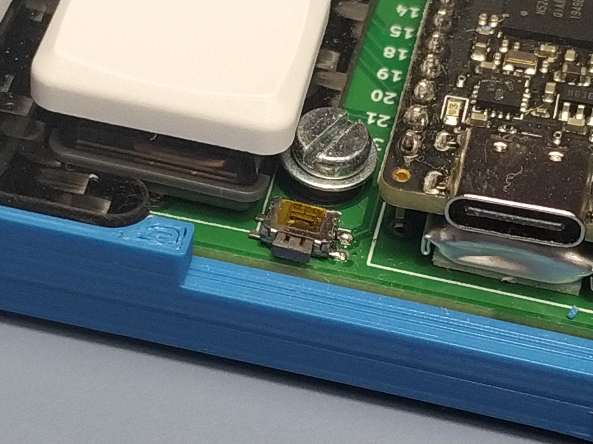
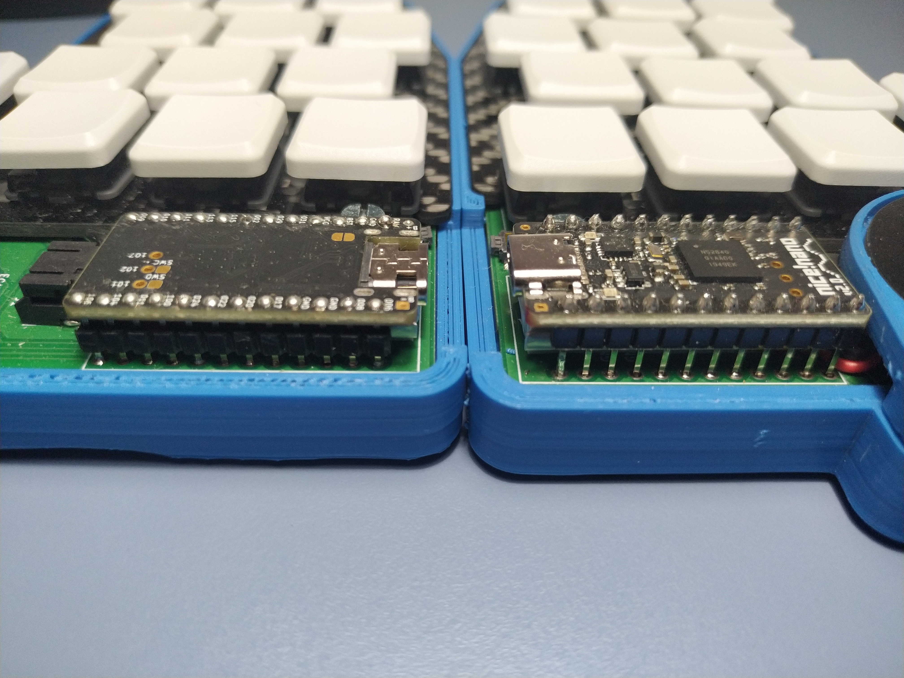
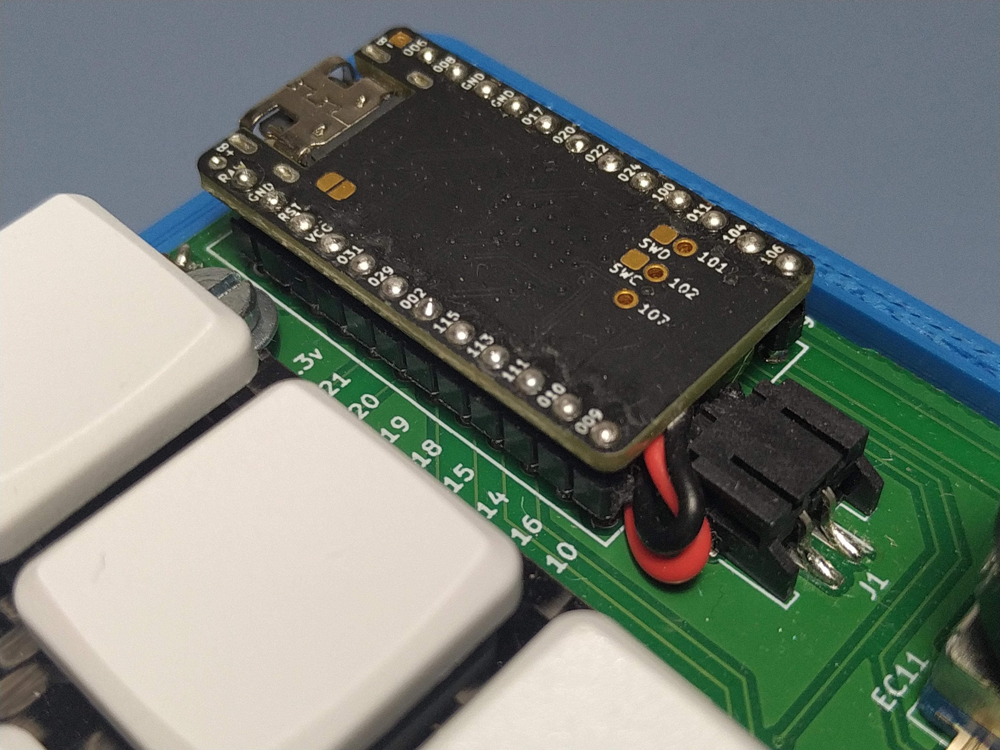
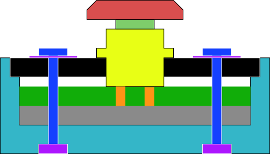
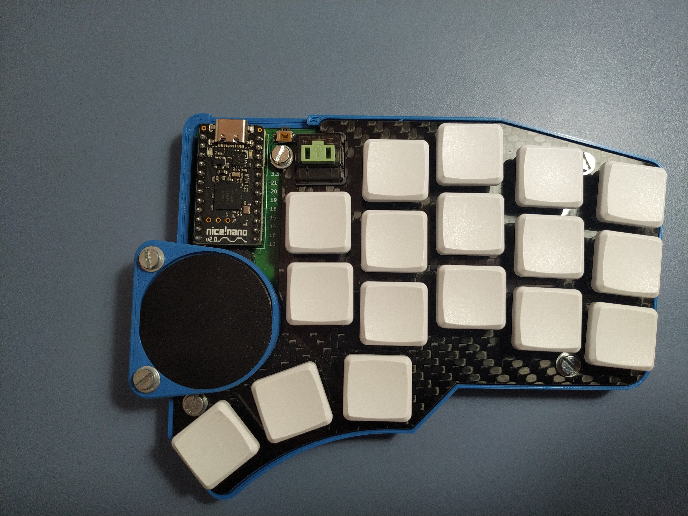
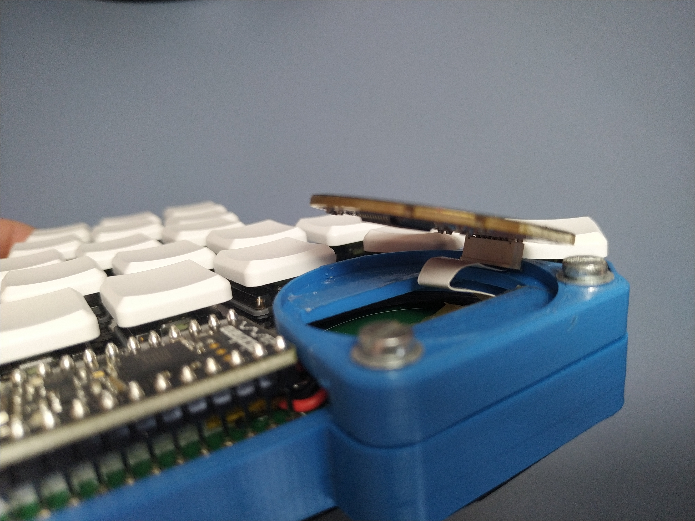

# Build Guide

The following is a comprehensive step-by-step guide on how to build the Daedalus keyboard. Due to a lack of resources, I cannot rebuild the keyboard, so there won't be images for all of the steps. You're welcome to contribute your own images whilst to this guide as you build.

## Bill of Materials

The items that have an asterisk can be replaced with others that better suit your needs, budget or preferences, and all the items that I used can be obtained from elsewhere **as long as they have the same dimensions and/or characteristics**.  If you have any doubts about whether an alternative product would be suitable, or you find that any of the products aren't correct, please contact me.

> [!note]
>I don't benefit in any way from listing any of the following products. For full disclosure, RS has kindly sponsored the making of this project, and I've used some of their products. That's why you'll see them listed.

| Item                                             | Min Amount | Recommended product                                                                                                        |
| ------------------------------------------------ | ---------- | -------------------------------------------------------------------------------------------------------------------------- |
| PCB (from GitHub)                                | 1          | Manufactured by JLCPCB                                                                                                     |
| SMD Diodes SOD-123                               | 36         | Bought from your PCB manufacturer. I used:    1N4148W C81598 from JLC                                                   |
| Nice!Nano                                        | 2          | https://typeractive.xyz/products/nice-nano                                                                                 |
| 110mAh Li-Po Battery                             | 2          | https://typeractive.xyz/products/lithium-battery-110mah?variant=46118748291303                                             |
| Cirque Trackpad 35mm                             | 1          | https://eu.mouser.com/ProductDetail/Cirque/TM035035-2024-002?qs=wd5RIQLrsJijxpRBQzhwPg%3D%3D                               |
| Alps C11 Rotary Encoder                          | 1          | https://mechboards.co.uk/products/kit-components-and-parts?variant=55527712260476                                          |
| Choc Switches                                    | 40 [⁴]     | https://holykeebs.com/products/ambients-silent-choc-switches?variant=47849514860834                                        |
| Choc Keycaps                                     | 34         | https://typeractive.xyz/products/mbk-keycaps?variant=45419753111783                                                        |
| Choc Keycaps Homing                              | 2          | I forgot, but I would buy: https://typeractive.xyz/products/mbk-keycaps?variant=45419753177319                             |
| FPC Cable (12 conductors, 0.5 mm pitch)          | 1          | https://eu.mouser.com/ProductDetail/Molex/15266-0120?qs=R8Vl3J6srxxjZ%2FhzpHORiQ%3D%3D                                     |
| FPC Connector (12 conductors, 0.5 mm pitch, SMD) | 1          | FH12-12S-0.5SH(55) Bought from your PCB manufacturer -  JLC Code: `C88360`                                                 |
| JST Connector                                    | 2          | https://eu.mouser.com/ProductDetail/Adafruit/1769?qs=GURawfaeGuBbgoGtf2XstA%3D%3D                                          |
| Button C&K’s KM                                  | 2          | Bought the wrong one, should've bought: https://www.ckswitches.com/products/switches/product-details/Tactile/KMR2/         |
| PLA Filament*                                    | 200 g [^2] | RS PRO 1.75mm Blue PLA 3D Printer Filament, 1kg                                                                            |
| Carbon Fiber* plate (1.5 mm thick)               | 1          | I got a scrap part, but carbon fiber is expensive. I'd either buy an acrylic or aluminum sheet.                            |
| EVA* Foam sheet (2 mm thick)                     | 2          | https://www.amazon.de/-/en/gp/product/B0074GOJ1E                                                                           |
| Painter's tape                                   | 1          | Can be bought from most stores. Must be adhesive from both sides. Should be decently strong to hold the trackpad in place. |
| M3 Screws 10 mm                                  | 8          | You can find them on most hardware stores                                                                                  |
| M3 Screws 15 mm                                  | 2          | You can find them on most hardware stores                                                                                  |
| M3 Hexagonal Nuts ~2 mm                          | 10         | You can find them on most hardware stores                                                                                  |
| M3 Washers ~1 mm                                 | 10         | You can find them on most hardware stores                                                                                  |
| Thin Adhesive Foam sheet* (1 mm thick) [^1]      | 2          | https://www.amazon.de/-/en/gp/product/B0F4XL8DKW                                                                           |
| Pin Headers (12 pin)                             | 4          | Should come with the Nice!Nano if bought from Typeractive                                                                  |
| TextToExpandTheColumn                            |            |                                                                                                                            |

## Equipment

- Soldering Station (Required)
	- Appropriate Safety Equipment
		- Air ventilation
		- Safety Glasses
		- Soldering Iron Stand
		- etc.
	- Soldering Iron
	- Thin Soldering Iron Tip
	- Solder Wire
	- Flux
	- Solder Tip Cleaner
	- Tweezers (Recommended)
	- De-soldering Tools (Recommended)
	- Magnifying glass (Recommended)
- Screwdriver compatible with your chosen screws
- Knife or other tool to cut foam (Laser cutter preferably)
- Clippers or saw to separate the PCB sides

Material dependent:

- Water Jet: for cutting carbon fiber
- 3D Printer: if using PLA
- SLA Printer or similar: if using resin
- Wood cutting tools: if using wood for the chassis

## Build Steps

- [Build Guide](#build-guide)
	- [Bill of Materials](#bill-of-materials)
	- [Equipment](#equipment)
	- [Build Steps](#build-steps)
		- [Ordering](#ordering)
		- [Manufacturing](#manufacturing)
		- [Soldering](#soldering)
		- [Assembly](#assembly)
		- [Firmware Flashing](#firmware-flashing)

### Ordering

Decide which components to buy from the [Bill of Materials](#bill-of-materials) and order them.

Order the PCB after downloading it from [GitHub](https://github.com/Perseus333/daedalus-keyboard/blob/main/hardware/daedalus.kicad_pcb).  Below are detailed steps on how to do that:

1. Download the necessary files
	- There are two routes: If you want to download the PCB as is, follow option A, if you want to check the PCB or make any modifications and make the gerber files yourself, follow option B (recommended).
	- OPTION A: Download the Gerber & others from GitHub
		1. Go to the [latest release](https://github.com/Perseus333/daedalus-keyboard/releases/latest) and download the `Gerber.zip`, the `BOM.csv` and the `positions.csv` .
	- OPTION B: Make the Gerber files yourself (Recommended)
		1. Open the PCB file on KiCAD
		2. (Recommended) Import the [external footprints](https://github.com/Perseus333/daedalus-keyboard/tree/main/hardware/footprints) into KiCAD. You can follow [the guide by Joe Scotto](https://github.com/joe-scotto/scottokeebs/tree/main/Extras/ScottoKicad) that's linked in the footprints directory. To download the Joe Scotto files, I would recommend using this [GitHub directory downloader](https://download-directory.github.io/?url=https%3A%2F%2Fgithub.com%2Fjoe-scotto%2Fscottokeebs%2Ftree%2Fmain%2FExtras%2FScottoKicad%2Ffootprints) tool, since Joe Scotto's repository is Gigabytes in size. 
		3. On KiCAD, once you have the PCB file opened, check that there are no errors: Go to the "Inspect" Tab > "Design Rules Checker" > "Run DRC". Make sure that there are no errors. Warnings are generally fine, but  read through all of them just in case.
		4.  Go to the "File" Tab > "Fabrication Outputs" > "Gerbers" > Specify "Output Directory" > "Generate Drill Files" (makes the holes!) > "Plot".
		5. Convert the output directory that you specified into a `.zip` file or just compress all the files into a `.zip` file.
		6. Then, download the BOM by going into "File" > "Fabrication Outputs" > "Bill of Materials..." and saving it your directory of choice.
		7. To download the Positions, go again to: "File" > "Fabrication Outputs" > "Component Positions..."  > choose the format as CSV and save it.
		8. If you're on KiCAD 9 you will need to modify the file so that JLCPCB can process it. Download their [sample BOM](https://static.jlcpcb.com//video/Sample-BOM_JLCSMT.xlsx) and [their sample positions file](https://static.jlcpcb.com//video/JLCSMT_Sample_CPL1.xlsx) modify the headers and columns of your CSV file so that it has the right headers and just the necessary columns.
		9. It may be helpful to remove all the components from the position and the BOM that you don't plan for them to assemble. If you're following the build as-is, remove everything but the Diodes and the FPC Connector.

2. Upload them to your PCB Manufacturer. The following are the steps for JLCPCB, they may vary from manufacturer to manufacturer. In the main page click "Add Gerber File" and submit your `.zip` file.
3. Once it's uploaded configure the settings. Below are the settings that I used along with the rationale:
   
	- **Base material: FR-4** 
		- Adequate, default and cheapest
	- **Layers: 2** 
		- No more layers are needed
	- **PCB Quantity: 5** 
		- Minimum order amount
	- **Product Type: Industrial/Consumer electronics** 
		- No need for the other options
	- **Different Design: 2** 
		- One for each side of the keyboard
	- **Delivery Format: Panel by customer** 
		- obligatory option given previous choice
	- **PCB Thickness: 1.6 mm** 
		- Default option, cheapest
	- **PCB Color: Green**
		- Default option, fastest shipping
	- **Silkscreen: White** 
		- No other options given
	- **Surface Finish: Lead Free HASL** 
		- Safer option
	- **Outer Copper Weight: 1 oz**
		- default option, cheapest
	- **Via covering: Tented**
		- Default option, covers vias and thus avoids solder splatter on pads
	- **Min via hole size/diameter: 0.3 mm** 
		- Default option, cheapest, no need for smaller vias
	- **Board Outline Tolerance: 2 mm** 
		- Cheapest, no need for higher precision
	- **Confirm Production file: Yes** 
		- No additional cost, provides an additional layer of ensuring that the files are ready for manufacturing
	- **Mark on PCB: Remove mark** 
		- No additional cost, cleaner look
	- **Electrical Test: Flying probe fully test**
		- No other options were given
	- **Gold Fingers: No**
		- Not needed, very high cost otherwise
	- **Castellated Holes: No** 
		- Not featured in current design
	- **Edge plating: No** 
		- Only option given the surface finish used

4. Turn the toggle at the bottom of the page that says: "PCB Assembly" if you don't want to solder the diodes in yourself (I recommend that they do it for you). I used the following settings:
   
	- **PCBA Type: Economic**
		- All of the components are in the front face, no need for Standard
	- **Assembly Side: Top Side**
		- The SMD diodes are placed in the front
	- **PCB Qty: 5**
		- We ordered 5 PCBs so might as well get diodes in all of them. There is no price penalty.
	- **Tooling holes: Added by JLCPCB**
		- No negative impact on the board and no need to specify them
	- **Confirm Parts Placement: No**
		- I got it right when I ordered it. If you modify the PCB you might want to select: "Yes" in this option.
	- **Parts Selection: By Customer**
		- You can upload the BOM and verify the components yourself
	- **Advanced options: Left as default**
		- No need to modify any of them

5. Upload your BOM and your placement files as prompted.
6. On the next step you will need to change the Diodes to a compatible and available product. I recommend the: `1N4148W C81598` since they're always in stock, quite cheap (1 cent per diode), and do the job.
7. Also change the FPC Connector to this one:  `FH12-12S-0.5SH(55) C88360` which matches the footprint.[^3]
8. It will send you to a preview. Double check that all of the Diodes are in their correct placement, and are visible in the "TOP" view and not the bottom one (unless you changed that).
9. Finally Save it to the Cart and order it! It should arrive in a week or so.

### Manufacturing

This section is intended for users that 3D print the chassis. If you're using other materials that require CNC, woodworking tools or anything else, feel free to add the steps that you followed.

0. If you want to modify any of the chassis, refer to the [chassis directory](https://github.com/Perseus333/daedalus-keyboard/tree/main/chassis) on the GitHub repository and download the STEP or CATIA files, depending on your CAD editor. Keep in mind that if you publish any modifications they must be released under the [CERN Open Hardware License v2 - Strongly Reciprocal](https://github.com/Perseus333/daedalus-keyboard/blob/main/LICENSE-HARDWARE) as per the licence of this project.

**3D Printing the chassis**

1. Download the STL files from the `STL.zip`  file of the [latest release](https://github.com/Perseus333/daedalus-keyboard/releases/latest)
2. Upload them to your printer and start printing. Follow your printer's instructions when in doubt.
   
**Cutting the foam manually**

There are many ways of doing it, but here's how I would do it.

1. Convert the DXF file into an SVG
2. In Inkscape, set the size to be the appropriate dimensions of the foam. You can extract the dimensions from either the STL or the STEP files provided.
3. Print out the SVG by converting it to a PDF with the same size. Cut out the silhouette and use that as a template when cutting the foam.

**Cutting the foam with a Laser Cutter**

>[!warning]
> Depending on the material of the foam, it may not be suitable for laser cutting. Do your own research before proceeding. Even if using EVA foam (the recommended) ensure that there is adequate ventilation of the fumes released.

1. Download the STL files from the `STL.zip`  file of the [latest release](https://github.com/Perseus333/daedalus-keyboard/releases/latest)
2. Convert the STL into the appropriate file for your laser cutter, such as DXF in your CAD editor.
3. Upload them to the CAM software of your laser cutter and align the shape to the edge leaving a couple of millimeters of clearance.
4. Tell your machine to cut it. Follow your laser cutter's instructions when in doubt.

**Cutting the Carbon Fiber top plate with a Water jet**
(Missing configuration used for water cutting carbon fiber)

1. Download the DXF files from the `DXF.zip`  file of the [latest release](https://github.com/Perseus333/daedalus-keyboard/releases/latest)
2. Upload them to the CAM software of your water jet
3. Print

### Soldering

**This is not a soldering tutorial**, if it's your first time soldering, I would recommend first looking other resources to get the basics down.

0. Prepare the environment: Use a soldering mat or similar to protect the table, have the soldering iron, solder wire, flux and solder tip cleaner at a comfortable distance.
1. Saw or cut with clippers the PCB parts along the mouse-bites (section with many holes). Optionally file it carefully to not damage the surface-mounted components.    
2. Solder both JST connectors through all of their contact pads as indicated in the PCB where it reads `J1/2`. It will be experiencing some torsional force due to the position of the battery
   

3. Solder the reset buttons to their appropriate layout as drawn in the PCB, next to the microcontrollers where it reads `SR1/2`.
   
   Note: The button leg should not be floating, I ordered the wrong component. Yours should be soldered by its four legs.

>[!important]
> The RIGHT side Nice!Nano goes with the TOP side UP. So you can see the nice!nano text. 
> The LEFT side Nice!Nano goes with the BOTTOM side UP. So, you  see the less populated side of the microcontroller.
> 
> As seen in the following image:
> 

4. The Nice!Nano if bought from Typeractive should come with some pin headers. Solder the pin headers SHORT side with the Nice!Nano. One Nice!Nano will sit on top of the pins with the "Nice!Nano" text looking up, whilst the other will look down, if placed as if the pin headers were its legs. Basically, each should be placed differently but both on the short headers. 
5. Connect the battery to the JST connector whilst holding the connector in place to not break the solder. Then, place the battery flat on the PCB in between the Nice!Nano GPIO holes, with the top side of the battery (the one where the cable comes from) being the closest to the connector.
6. Place the Nice!Nano with the pin headers on the GPIO holes, whilst keeping the battery cable out of their way. This step may require some care. I moved the cable out and in to the connector as shown in the image below.
   

7. Whilst keeping the battery in place with the Nice!Nano and it's pin headers, solder the long side of the headers through the bottom side of the PCB into the board. You *may* need a second pair of hands to hold things in place. I would recommend soldering first the two farthest pins diagonally since it will hold better and it's easier to end up level. Once you have 3-5 pins on the different corners soldered, it's safe to stop holding the microcontroller in place, and you can just solder the rest. Repeat for both sides.

>[!important]
> Before going any further, make sure that you understand the following diagram. It's a simplified section view of the keyboard that describes the order of the components. Note: The space between the top plate and the PCB is air.
> 
> 
> 
> Legend:
> Light Blue is the chassis; black, the top plate; green is the PCB; gray corresponds to the foam; dark blue are the screws; purple is the washers (top) and nuts (bottom) ; the yellow in the middle is the switch, with the red being the keycap and the pins being orange.

8. Put a keycap on each switch, keeping in mind that two of them will be homing keycaps (if you have bought them).
9. Mount the switches on the plate one by one. You should hear a *click* noise when doing so. Although as long as they don't fall out when nudging them slightly it's fine. I have experienced that if you first put the left/right side of the switch and then the other after, it's a little bit easier than trying to place both of them at the same time.
10. Once they're all in place gently push any of the outer keys and plate into the PCB whilst holding the key that you're pushing in, in place. Then in the same manner, do so with the switches at the opposite end. Don't force it or you might bend some pins. Slowly and one by one, push all of the keys into place. In my experience this was pretty seamless, but if it's not, try removing any potential junk from the holes that don't let the switches fit.
11. Once all of the keys are in place, add turn the whole thing with the PCB facing up, and start soldering all of the pins to their holes.
12. Now solder the rotary encoder into the board, making sure to also solder in the solder pads and not just the pins.
13. Unless you somehow bought the SPI version of the trackpad, which has a resistor on the R1 slot ([more information (page 9)](https://eu.mouser.com/datasheet/3/1575/1/TM035035_SPI-I2C-PINNTrackpad_SPEC1-2.pdf)), you're done with soldering! Otherwise, just remove it.

### Assembly

This is the easy part!
1. Place the foam inside the case at the bottom of it
2. Place the soldered PCB with the top plate and everything. The top plate should be more or less at the same level (probably a bit higher) than the case
3. Put a nut inside each of the hexagonal containers of the bottom of the case/chassis and lay the keyboards flat.
4. Put a washer in the short screws (10 mm ones) and drive them through the mounting holes of the plate, PCB and case, then screw them into the nut by hand, and secure each of them with a screwdriver without applying too much pressure. In the image shown below you can see the location of all the 4 screws + the 2 long ones for the trackpad:

5. The left side is done. On the right side, connect the FPC cable into the connector that is soldered onto the PCB.
6. Then, align the trackpad holder into its correct position over the case and screw it in the same way as in Step 4, but use this time the 15 mm screws.
7. Once secured in place, cut the two sided adhesive tape (painter's tape works fine) into small pieces that can fit on the top surface inside the trackpad holder next to the square hole for the FPC cable. Place one small section on each side, but keep in mind that the bigger the area, the better it will hold down.
8. Connect the FPC cable inside of the trackpad making sure that the trackpad is placed, so that the FPC connector that it has integrated is facing the FARTHEST to the Nice!Nano. You can align it rotationally by ensuring that the flat sides of the trackpad, are aligned with the flat sides of the trackpad holder on the right and left of the circle. As shown in the image below:

9. Once that's secured in place, you can cut out a part of the thin adhesive EVA foam with the silhouette of the keyboard and stick it below the case, this will prevent it from moving on the table whilst typing. I have it as shown the the image below and it doesn't slip at all:

10. And you're done! The hardware part is complete! 

### Firmware Flashing

This section just describes how to get the firmware up and running. If you're interested in modifying it refer to the firmware repository: [zmk-keyboards-daedalus](https://github.com/Perseus333/zmk-keyboards-daedalus/tree/master).

1. Start charging the modules with a USB-C power cable by connecting it to the Nice!Nano.
2. Download the firmware from the `firmware.zip` in the [latest release](https://github.com/Perseus333/daedalus-keyboard/releases/latest)
3. Extract its contents to an accessible directory, you should see a right and left file.
4. On the keyboard side that has battery, or is charging (you should see an orange light, if it's the left side, you should look below the controller) double press the small reset button right next to it. You should see a blue light from another LED start flashing. If it doesn't light up, try again with different tempos.
5. The blue light indicates that the bootloader mode is on. Connect a USB-C cable THAT CAN TRANSFER DATA (some charging cables can't) between your computer and the Nice!Nano.
6. Open your file explorer, you should see a new drive pop-up called "nice-nano". Open it, it will have some files inside.
7. Copy and paste in the file for the correct firmware for that side. You should see it processing for a moment before turning the light on. If you connected the right side, try typing, it should already work.
8. Do everything from step 4 with the other part, and upload the right file for the side.
9. And that's it! You're done. You have your own working daedalus.
10. The default key map right now is my version of [Colemak-DH](https://colemakmods.github.io/mod-dh/) with layers very similar to [Miryoku](https://github.com/manna-harbour/miryoku). If you wish to change it [download ZMK Studio](https://zmk.studio/download), or alternatively, clone the zmk-keyboards-daedalus repository and modify the `boards/shields/daedalus/daedalus.keymap` file with the help of the [ZMK Docs](https://zmk.dev/docs/keymaps).

[^1]: The thickness doesn't matter, but 1 mm makes the keyboard profile lower. Also, I've had success with EVA foam, but any other foam, or even rubber pads may be used. It's just to prevent slipping. 
[^2]: I don't know the exact amount, but eyeball it so that you have enough to complete the build. 200 g is a conservative estimate. If you build this and manage to know the exact amount used, please let me know.
[^3]: Fun fact, I found out that JLC has this part after building my keyboard. I ended up ordering the wrong component and had to solder from the traces.
[^4]: Just in case some switches break I would at least buy 4 spare ones. Also, most shops sell them in packs of 10, so you cannot buy just 36 keys anyway.